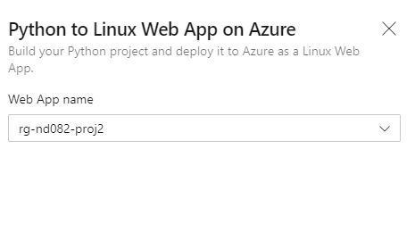

# Table of Contents

- **[Overview](#Overview)**

- **[Project Plan](#Project-Plan)**

- **[Architecture Diagram](#Architecture-Diagram)**

- **[Build Status](#Build-Status)**

- **[Instructions](#Instructions)**
  
  - **[Configuring Github](#Configuring-Github)**

  - **[Running Project Locally](#Running-Project-Locally)**
  
  - **[Project Azure App Service](#Project-Azure-App-Service)**

    - **[ML Azure App Service](#ML-Azure-App-Service)**
  
  - **[Github Actions](#Github-Actions)**
  
  - **[Azure DevOps](#Azure-DevOps)**
  
    - **[Azure Pipeline Setup](#Azure-Pipeline-Setup)**

    - **[Azure Pipeline App](#Azure-Pipeline-App)**

- **[Enhancements](#Enhancements)**

- **[Demo](#Demo)**

## Overview

In this project we will be implementing a CI/CD process for a sample Python ML application. Continuous Integration will be done using Github actions and
Continuous Delivery will be implemented using Azure Pipeline. We will also be using Azure Cloud shell in this project.

Main Goals

- Azure Cloud Shell
- Continuous Integration using Github Actions
- Continuous Delivery using Azure Pipelines

## Project Plan

- [Trello Board](https://trello.com/b/u5fJQCgH/nd082-project2-agile-sprint-board)
- [Original Project Plan](project-docs/CI-CD-Project-Planning.xlsx)
- [Final Project Plan](project-docs/CI-CD-Project-Planning-Final.xlsx)

## Architecture Diagram

[Architectural Diagram](screen-shots/architecture.png)

## Build Status

[](https://github.com/ramaganesan/nd082-project2/actions)

## Instructions

### Configuring Github

- Log into Azure Cloud Shell

- Create a ssh key

    ```bash
    ssh-keygen -b 4096 -t rsa
    ```

- Copy the public key to your Github Account -> settings/keys

- Once your public key is in Github, we can download the source code to Azure Cloud Shell

  - 

  - 
  
  - 

### Running Project Locally

- Clone the project (In this project we used Azure Cloud Shell)
- Create a Python Virtual Environment to run your application

  ```bash
    python3 -m venv ~/.flask-ml-azure
    source ~/.flask-ml-azure/bin/activate
    make all
    export FLASK_APP=app.py
    flask run
  ```

- Above step would launch a Python Virtual Environment and would run the application. Launch a new Azure Cloud shell session and test the application by running the make_prediction.sh script

    ```bash
    ./make_predict.sh
    {"prediction":[20.35373177134412]}
    ```

- ```CTRL-C``` to stop the Flask application

- To deactivate the virtual environment run ```deactivate```

  - 
  
  - 
  
  - 

### Azure App Service

Azure App Service is a PASS solution provided by Azure which enables to quickly deploy web apps, mobile back-ends and RESTful API's without managing the infrastructure. Below are some of the advantages

- Support multiple languages(Java, Python, C#) and frameworks(.NET, Spring boot, Flask)

- High Availability and Scalability

- Supports both Windows and Linux OS

- Very good integration with Azure pipelines for Continuous Delivery

For more information and Tutorials please refer
[Azure App Service](https://docs.microsoft.com/en-us/azure/app-service/)

#### ML Azure App Service

Azure App service offers multiple ways to create a new application. In this section we will be using the Azure CLI to deploy our app. In the another section we will show how to use the Azure Pipelines to deploy our application.

**Set up Azure CLI:**

- Create a new Resource Group for our app

   ```bash
    az group create --name nd082-project2-rg --location eastus
    ```

**Deploy Application:**

- Clone the project (In this project we used Azure Cloud Shell)

- Create a Python Virtual Environment to run your application

    ```bash
        python3 -m venv ~/.flask-ml-azure
        source ~/.flask-ml-azure/bin/activate
        make all
    ```

- Deploy application into the our resource group

    ```bash
    az webapp up --name rg-nd082-proj2 --resource-group nd082-project2-rg --sku FREE
    ```

- Our application will be deployed and available at
  **(https://${app-name}azurewebsites.net)** default port is 443

**Test ML Application:**

- Edit the ```make_predict_azure_app.sh``` with the correct host name of the application

- Run the script to test the app

    ```bash
        ./make_predict_azure_app.sh
        {"prediction":[20.35373177134412]}
    ```


**Logs of Azure Webapp:**

Azure App service provides ability to view the application logs. Application logs was be accessed using Azure CLI commands

    ```bash
        az webapp log tail --name rg-nd082-proj2 --resource-group nd082-project2-rg
    ```


### Github Actions

Github actions is a feature of Github to do a complete CI/CD workflow. In this project we use Github actions to do our Continuous Integration workflow. We build, lint and test the code using Github actions.

- In your Git Repository, go to Actions Tab -> New Workflow -> Python Application Workflow ***Git hub can analyze your code and bring relevant workflow for your code***


- Continue with the process, and Github Actions workflow will be setup for our code

- We will have to customize the actions for our needs. The default action steps will run the python commands, since we are using *Make* to 
build, test and lint our code we will modify the Github actions code.

- Edit the .github/workflows/python-app.yml

    ```yml
    # This workflow will install Python dependencies, run tests and lint with a single version of Python
    # For more information see: https://help.github.com/actions/language-and-framework-guides/using-python-with-github-actions
    
    name: Python application
    
    on:
      push:
        branches: [ master ]
      pull_request:
        branches: [ master ]
    
    jobs:
      build:
    
        runs-on: ubuntu-latest
    
        steps:
        - uses: actions/checkout@v2
        - name: Set up Python 3.5
          uses: actions/setup-python@v1
          with:
            python-version: 3.5
        - name: Install dependencies
          run: |
            make install
        - name: Lint with Pylint
          run: |
            make lint
        - name: Test with pytest
          run: |
            make test
    ```

- Run the Action Manually. Once successfully launched you will see the result below


- Once the workflow is setup we will be able to Continuously build our application for every push or pull request on our master branch

### Azure DevOps

Azure DevOps is one shop tool for Agile Project Management. It has all the tools necessary to manage a Agile Project

- Azure Boards for Agile Project Management

- Azure Pipelines for CI/CD

- Azure Repos for repository management

- Azure Test Plan to manage Manual and Automated Testing

- Azure Artifacts to host, share packages

- Extension Marketplace where app builder has provided feature for Azure Devops

#### Azure Pipeline Setup

In this project we use Azure Pipelines for Continuous Delivery of Flask ML App.

- Navigate to [dev.azure.com](https://dev.azure.com) and sign in. You might have to create a Free Account if you don't have a Azure DevOps account

- Create a new Project. In Azure DevOps Project is a collection of different services offered by Azure DevOps, like Azure Boards, Azure Pipelines etc. In our project we will use only Azure Pipelines

- Once the project is created, navigate to Project Settings -> Pipelines -> Service connections -> New Service Connections


- In the New Service Connections dialog select Azure Resource Manager


- In the Service Connection dialogue box
  1. Select scope as Subscription
  
  2. You might need to log in

  3. Pick the Resource Group of the Azure Web App deployed Before
  
  4. Provide a valid Service Connection Name
  
  5. Make sure you check the box *Grant Access Permissions to all pipelines*
  
  

#### Azure Pipeline App

- In the project that was created above, navigate to PipeLines -> New Pipelines

- In the New Pipeline Interface -> Select GitHub as Repo -> Select the Project 


- In Configure, select *Python to Linux Azure Webapp* -> select the deployed app -> Validate and Review




- In the Review, validate the Pipeline YAML and hit the *Save and Run* button, you might be prompted to save the code into GitHub


- We can also Customize the pipeline to our needs as well

- Now that the pipeline is configured, we can Continuously Deliver our ML Flask App


## Enhancements

As in any project we can do improvements

- Create CI/CD project using Jenkins pipelines
- Run tests and validation in a separate infrastructure before promoting the application code to azure web app

## Demo

[CI/CD Demo Link](https://youtu.be/n3JZcgZ4Abk)
